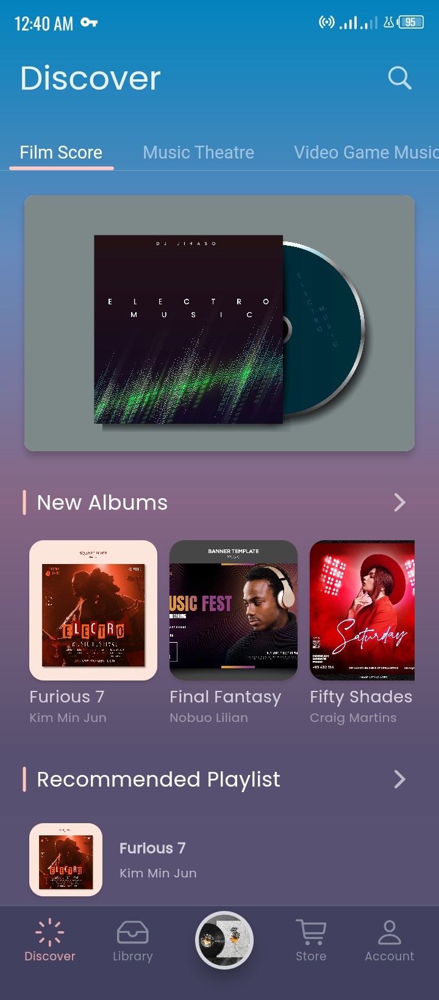
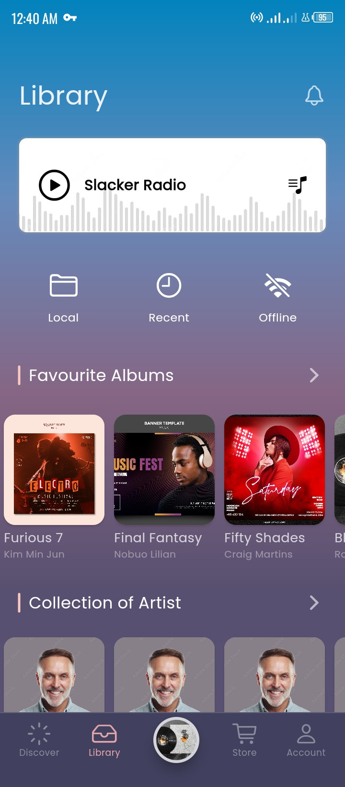
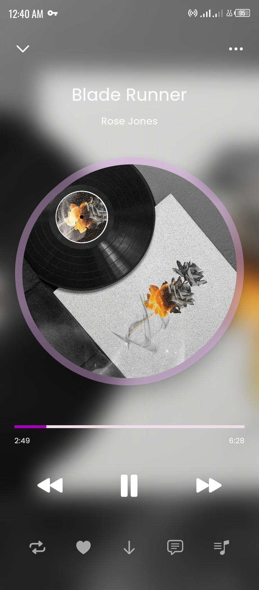
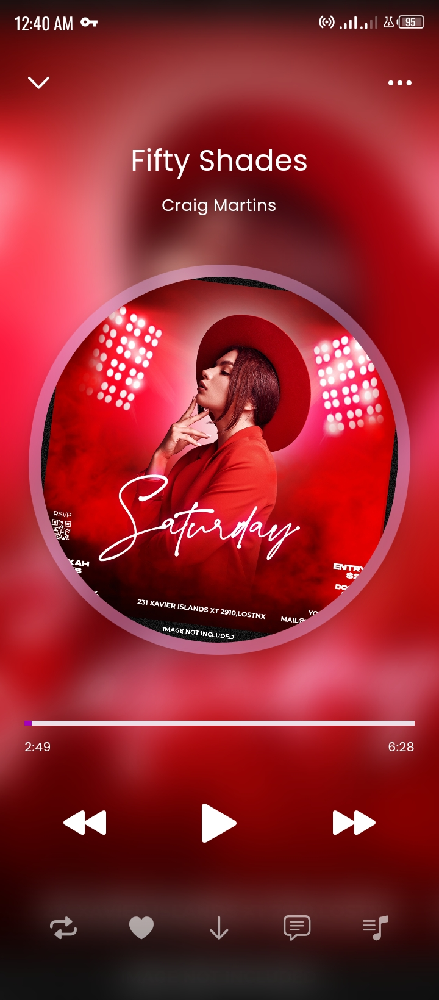
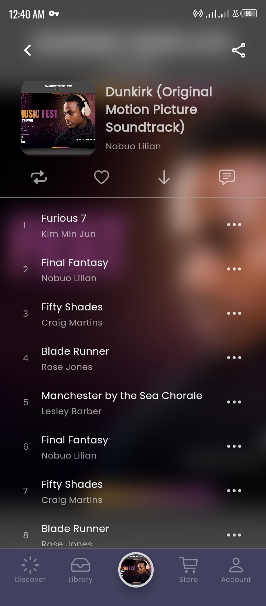

# ost_music_app_ui

A Music Application Flutter project.

## Screenshots






<video src="screenshots/screen-20230418-003928.mp4" width="300" height="600" title="screencast"></video>


## Packages

```yaml
dependencies:
  flutter:
    sdk: flutter

  bottom_nav:
    git:
      url: git@github.com:kenresoft/bottom_nav.git
      ref: master
  fontresoft:
    git:
      url: git@github.com:kenresoft/fontresoft.git
      ref: master
  extensionresoft:
    git:
      url: git@github.com:kenresoft/extensionresoft.git
      ref: master
  cupertino_icons: ^1.0.5
  go_router: ^6.5.7
  flutter_riverpod: ^2.3.4
```

## Getting Started

This project is a starting point for a Flutter application.

A few resources to get you started if this is your first Flutter project:

- [Lab: Write your first Flutter app](https://docs.flutter.dev/get-started/codelab)
- [Cookbook: Useful Flutter samples](https://docs.flutter.dev/cookbook)

For help getting started with Flutter development, view the
[online documentation](https://docs.flutter.dev/), which offers tutorials,
samples, guidance on mobile development, and a full API reference.
